# 🕵️‍♂️ Security Footage CTF Forensics Tryhackme

Ever unraveled a seemingly ordinary PCAP file only to discover a hidden trove of digital clues? This challenge was exactly that kind of forensic puzzle — diving deep into network traffic to recover destroyed security footage. From dissecting TCP streams and decoding hex dumps to carving out fragmented images and reconstructing video footage, this investigation tested every step of the forensic toolkit. Join me as I break down the process, relying solely on command-line tools and scripting to piece together the story hidden in the chaos of captured packets.


## 📘 Challenge Overview

**Room Link:** [Security Footage](https://tryhackme.com/room/securityfootage)

> Perform digital forensics on a network capture to recover footage from a camera.

> Someone broke into our office last night, but they destroyed the hard drives with the security footage. Can you recover the footage?

> Today chall will be based on CLI only, bit challenging since I was using WSL not my kali machine. lets see how do i solve it.
---

## 🔍 Initial Network Analysis

1. Opened the provided PCAP file using **tshark** in `wsl`.
2. Checked the **Protocol Hierarchy** to get an overview of protocols present I used **`my own script`** to do this.
3. Found **HTTP traffic** under TCP streams, indicating possible **file transfers** or **data exfiltration**.
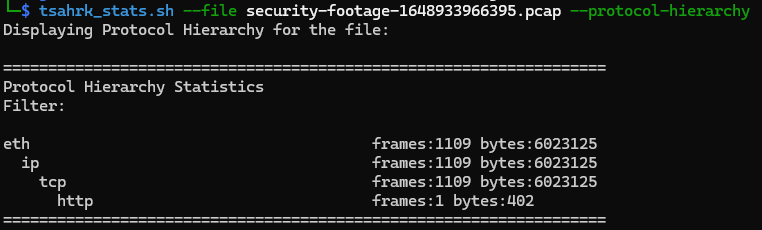


---

## 📦 Data Extraction and Analysis

1. Followed the HTTP streams.
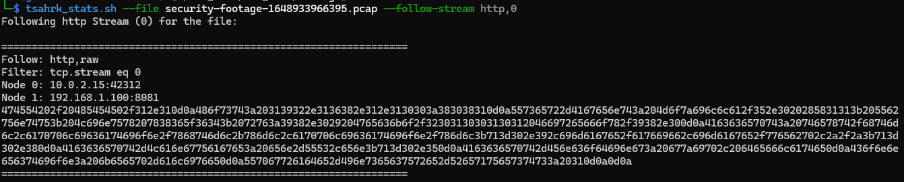

2. Initial HTTP payload **decoding** revealed nothing significant.
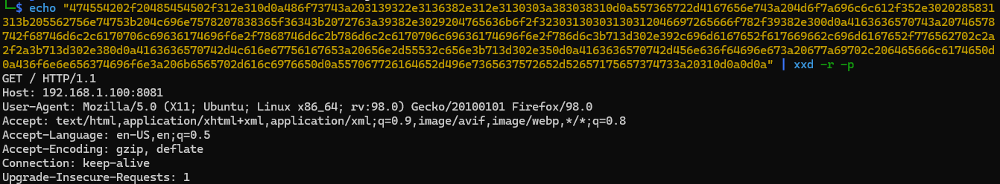

3. Shifted focus to **TCP streams**
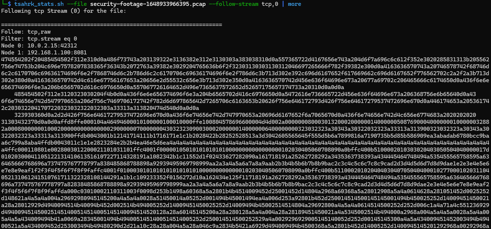

4. Decode the tcp paylaod, It appeared more promising.
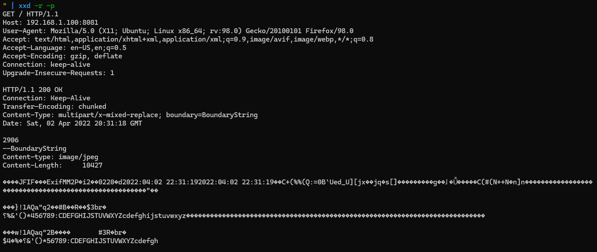


5. Cleaned the output by deleting **irrelevant first lines** from script output.
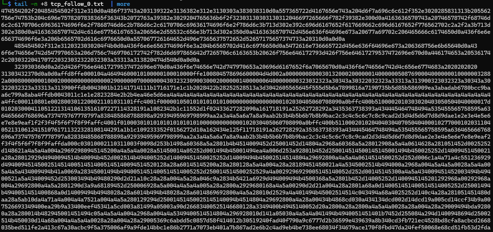

6. Converted the **cleaned hex data** to raw bytes for further inspection.


7. Identified the data as a raw file and checked its **file type**.
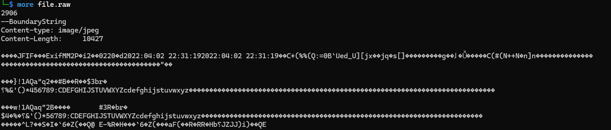
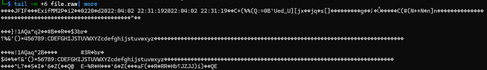

File type recognized as a **JPEG JFIF image**.
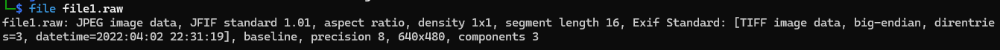
---

## 🔥 Image Analysis and Data Recovery

1. Opened the extracted JPEG image; it contained the flag **first 4 caracters**.
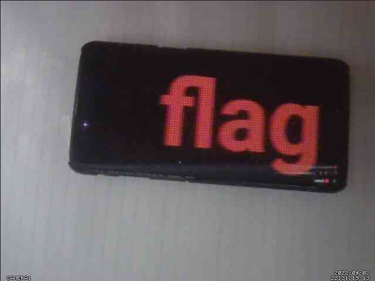

2. Noticed the image size was unusually large **(5.7 MB)**, `suspicious` for a simple flag image.
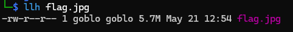

3. Hypothesized that the image contained **hidden or fragmented data**, possibly remnants of destroyed footage, let's try to carve data from the raw image file.
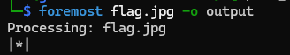

4. Extracted **541 images** from the data, confirming extensive hidden content.
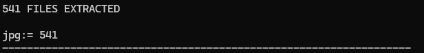

5. Verified the **first** extracted image matched the original suspicious image.
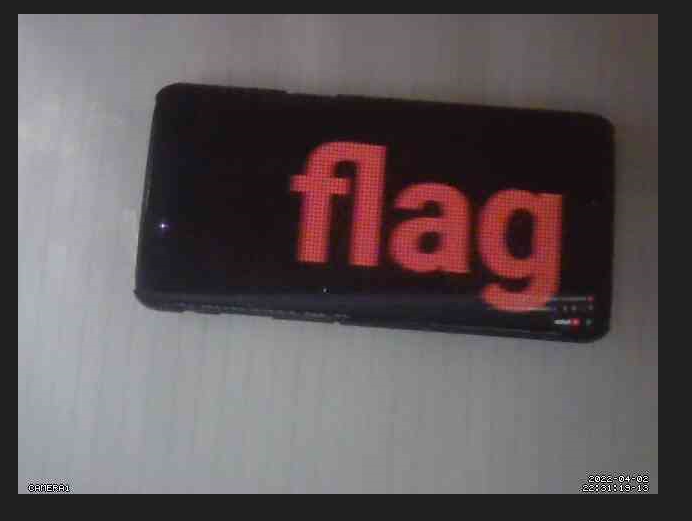

6. Checked the **last** extracted image
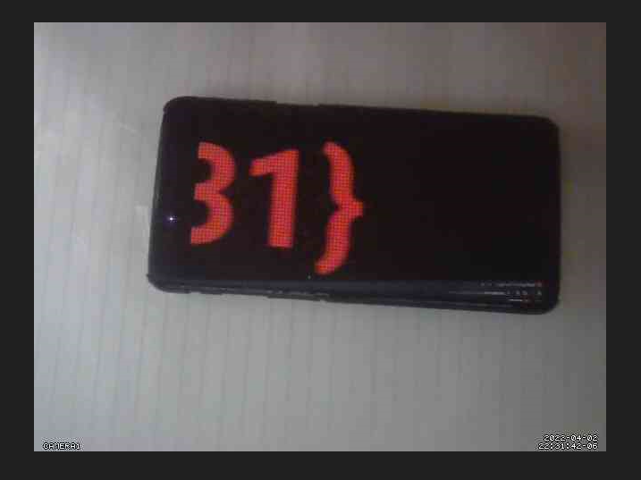
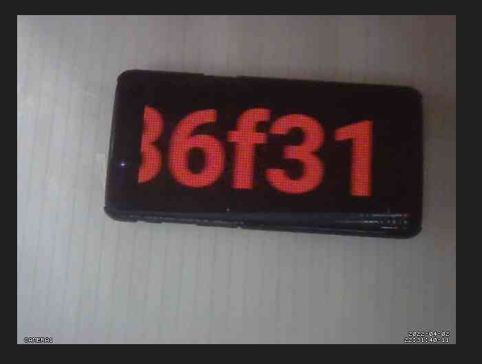

- all images contained parts of the flag or relevant data.
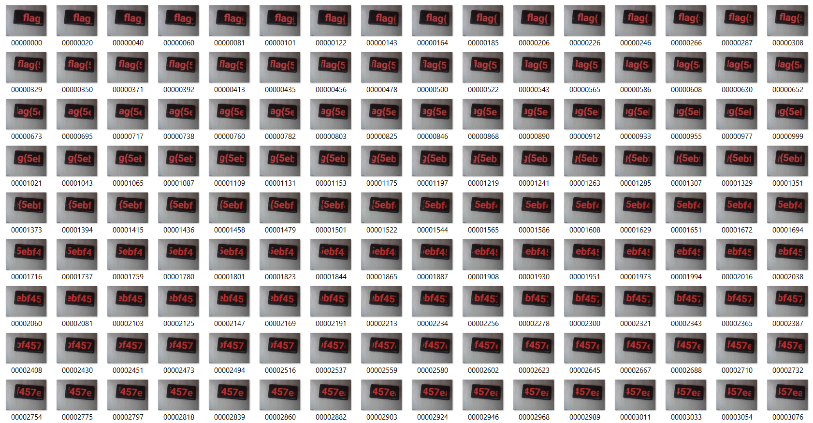

---

## 🧠 Reconstruction and Final Recovery

1. Decided to **reconstruct the extracted images** into a **video** file to recover the original footage.
    - First, lets order the images by name
    ```bash
    ls *.jpg | sort | sed "s/^/file '/; s/$/'/" > images.txt
    ```


2. Used video creation tool **`ffmpeg`** to assemble images into an MP4 video.

```bash
ffmpeg -f concat -safe 0 -i images.txt -vsync vfr -pix_fmt yuv420p -c:v libx264 flag.mp4
```
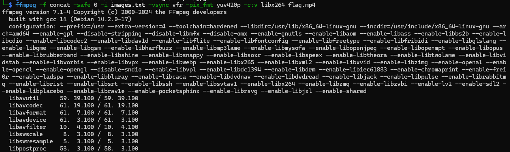

3. The reconstructed video revealed the **final flag**.
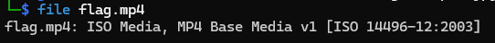

---

## 🛠️ Bonus: Extraction Automation via python Script

```py

```

---

## ✅ Outcome

Successfully:

    - extracted and identified a hidden JPEG image containing the flag.
    - Recovered fragmented images embedded in the data stream.
    - Reconstructed the images into a video file.
    - Retrieved the final flag from the recovered footage.

---

## 🧰 Tools Used

- `tshark` (CLI packet analysis)
- Custom hex decoding scripts
- `foremost` (data carving)
- `file` (file type identification)
- `ffmpeg` (video creation from images)

---

## ✍️ Notes

- This challenge was tackled entirely on the command line using tools like tshark and custom scripts, which made the analysis more challenging but showcased how powerful CLI-based PCAP analysis can be.

- Working without GUI tools required careful stream decoding, hex conversions, and data carving purely via CLI utilities.

- Reassembling extracted images into a video is a creative approach to reconstruct destroyed footage.

---

> 🏁 *Flag successfully retrieved: `<flag>`*