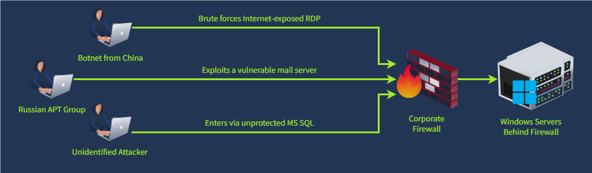
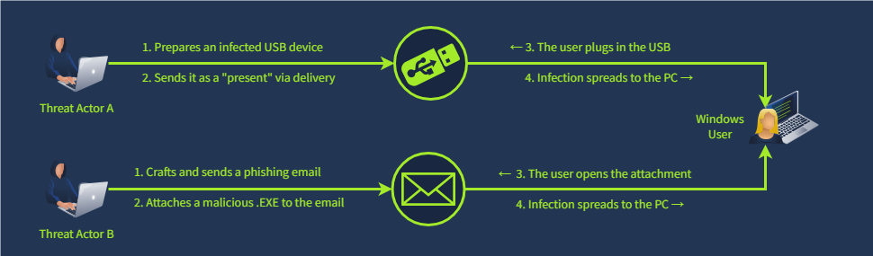

# Windows Threat Hunting:

## Initial Access:


**Exposed Services**
- Putting a Windows server directly on the Internet is a common task for IT teams. However, every exposed service introduces major security risks.

    
    **Mitre Attack techniques**
    - `T1133 / External Remote Services`: look for exposed RDP/VNC/SSH with weak passwords.
    - `T1190 / Exploit Public-Facing Application`: look for misconfigured or vulnerable websites.

**User-Driven Methods**
- how can the laptop be infected if it is not Internet-exposed? However, people often help threat actors by clicking on malicious links, launching phishing attachments, using pirated software, picking up unknown USB devices...

    
    **Mitre Attack techniques**
    - `T1566 / Phishing`: 
    - `T1091 / Removable Media`: infect a USB device and hope that users will use the USB on multiple PCs.

### **Detecting RDP Breach**

**RDP Brute Force**
- Botnet starts a brute force of common user names
    ```
    1. Open Security logs and filter for the failed logins (event ID `4625`)
    2. Filter for logon types `3` and `10`, meaning remote logons
    3. Filter for logins from `external IPs` (use "Source IP" field)
    4. That's it. You have detected a potential RDP brute force
    ```

**Initial Access via RDP**
- After around 100 attempts, the botnet guesses
the correct password and enters the system
    ```bash
    1. Continue with the list from the previous step
    2. Switch the event ID filter to `4624` (successful logins)
    3. Check the account under which the logon was made
    4. Now you know which account was used for the Initial Access
    # 4624 + logon type 3 to get info of external source IP and name of the attacker machine 
    ```

**Further Malicious Actions**
- Two hours after the breach, the threat actor
logs in via RDP and reviews the Desktop
    ```
    1. Continue with the list from the previous step
    2. Filter for logon type `10`, indicating interactive RDP login
    3. Copy the "`Logon ID`" field from the logon event
    4. Open `Sysmon logs` and search events with the same "`Logon ID`"
    5. You will see all `processes` started by the threat actor via RDP

    ```

---

Discovery Commands
------------------

The first questions you may have once you wake up from a dream might be "Who am I?" and "Where am I?". The same is true for threat actors that might have sent thousands of phishing attachments to all emails they knew but managed to breach only a couple of systems they saw for the first time. So, they need to find out the victim's details:

## Discovery Purpose – Common CMD / PowerShell Commands

| Category | Purpose | CMD / PowerShell Commands |
|---------|----------|---------------------------|
| **Files and Folders** | To find out the host purpose, victim’s job, or their interests | `type <file>`, `Get-Content <file>`, `dir <folder>`, `Get-ChildItem <folder>` |
| **Users and Groups** | To find out who uses the host and with which privileges | `whoami`, `net user`, `net localgroup`, `query user`, `Get-LocalUser` |
| **System and Apps** | To find out vulnerabilities or apps to steal data from | `tasklist /v`, `systeminfo`, `wmic product get name,version`, `Get-Service` |
| **Network Settings** | To find out if the host belongs to a corporate network | `ipconfig /all`, `netstat -ano`, `netsh advfirewall show allprofiles` |
| **Active Antivirus** | To find out how risky it is to continue the attack without being blocked | `Get-WmiObject -Namespace "root\SecurityCenter2" -Query "SELECT * FROM AntivirusProduct"` |


